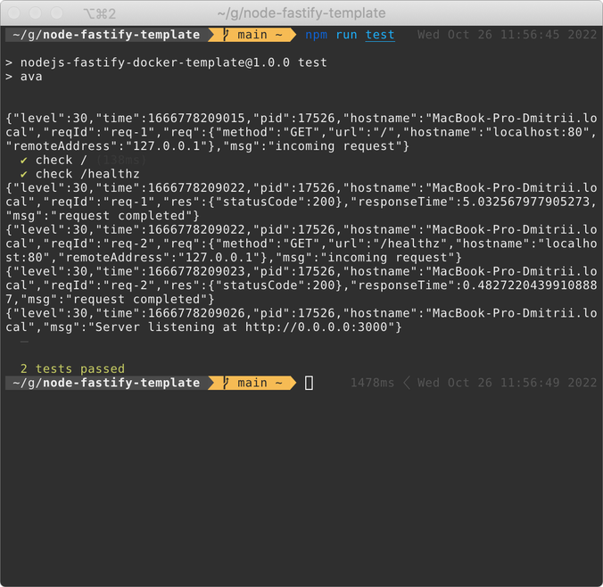

# nodejs fastify docker template

### description
Simple docker container with fastify microservice.

### usage
1. Clone this repository and run `docker build -t fastify-template ./nodejs-fastify-docker-template`. 
2. Run docker image `docker run -p 3000:3000 fastify-template` and [test it](http://localhost:3000/).

### tests
Run `npm run test` command:

